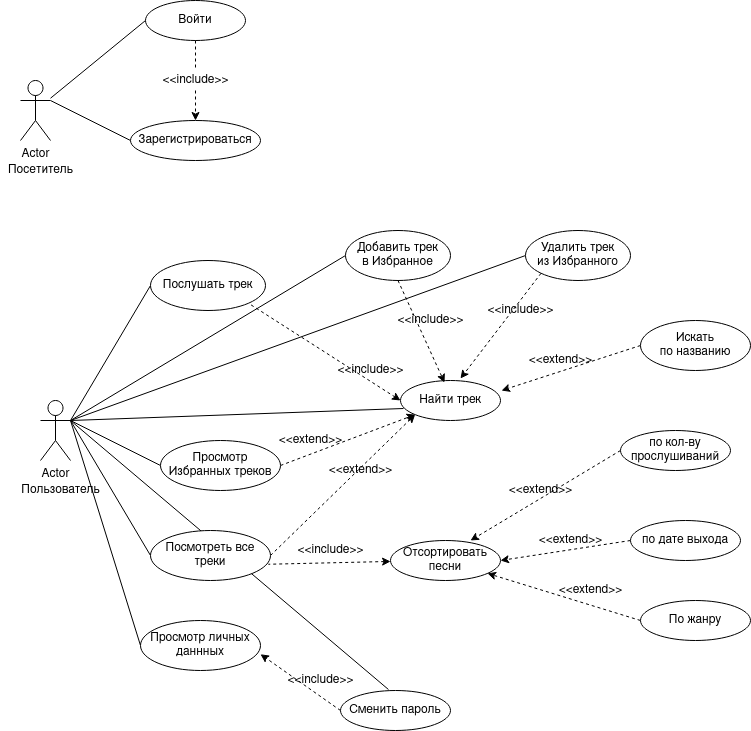
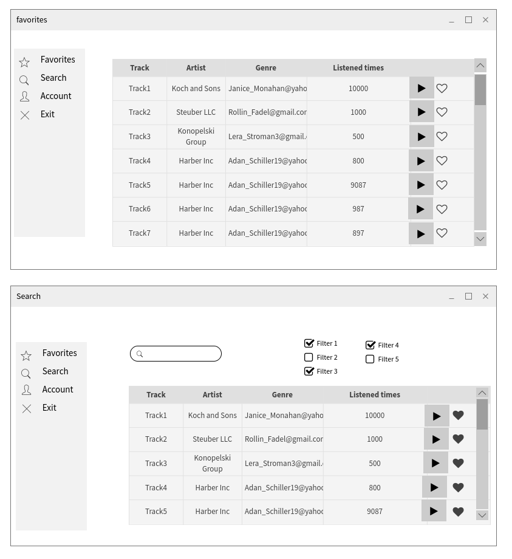
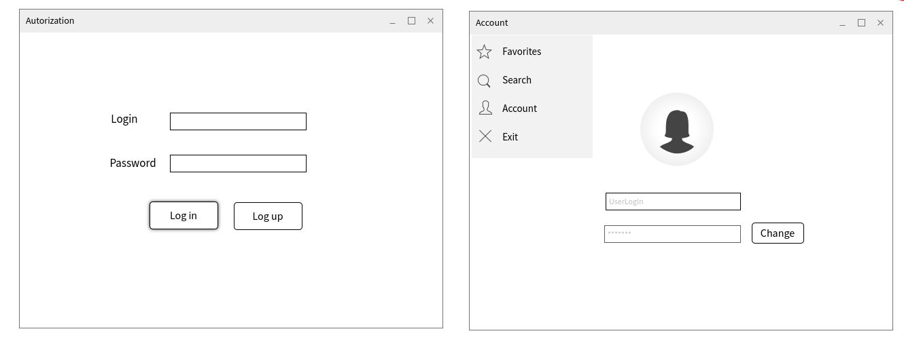

## Цель работы:

Написание веб-приложения для прослушивания музыкальных треков и возможностью добпвлять их в "Избранное".

Функциональные требования к приложению:

Приложение должно предоставлять возможность
- регистрации нового пользователя
- входа зарегистрированного пользователя в систему
- изменения пароля для пользователя, вошедшего в систему
- интерфейс для просмотра, поиска, прослушивания треков
- интерфейс для добавления, удаления, просмотра треков в "Избранное" 

## Use-case диаграмма

## Экраны будущего приложения

